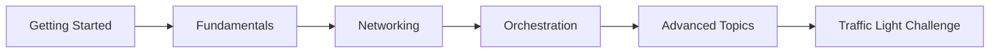

<!-- This is the landing page for Github pages -->
<!-- YAML front matter is a block of metadata (key-value pairs) placed at the very top of Markdown files, enclosed by triple dashes (---) -->

# Docker Learning Hub

Master Docker through hands-on practice

- [Get Started](){: .btn .btn-primary }      <!-- Styles link as a button -->

- [GitHub Pages Notes]()

- [View on GitHub](https://github.com/manju838/docker-learning-hub){: .btn .fs-5 .mb-4 .mb-md-0 }

---

## 🚀 Why Learn Docker?

Docker revolutionizes how we build, ship, and run applications. Whether you're a developer, sysadmin, or DevOps engineer, Docker skills are essential in modern software development.

**Benefits of mastering Docker:**
- ✅ Consistent development environments across teams
- ✅ Faster deployment and scaling
- ✅ Improved resource utilization
- ✅ Simplified dependency management
- ✅ Industry-standard containerization platform

---

## 📚 What You'll Learn

### 🎯 Fundamentals
Learn Docker basics, images, containers, and essential commands to get started with containerization.

### 🌐 Networking
Master container networking, bridge networks, and inter-container communication.

### 🎼 Orchestration
Use Docker Compose to manage multi-container applications and complex deployments.

### 🚀 Advanced Topics
Production-ready practices, security, optimization, and real-world deployment strategies.

---

## 🚦 The Traffic Light Challenge

Put your skills to the test with our **unique hands-on project**! Build and deploy three interconnected web applications (red, yellow, green) while learning:

- Writing Dockerfiles
- Building custom images
- Container networking
- Nginx reverse proxy
- Load balancing
- Docker Compose orchestration

[Start the Challenge](about#-the-traffic-light-challenge){: .btn .btn-green }

---

## 🛤️ Learning Path

**Recommended progression:**
1. [Getting Started](getting-started) - Set up your environment
2. [Fundamentals](fundamentals) - Learn the basics
3. [Networking](networking) - Understand container networking
4. [Orchestration](orchestration) - Master Docker Compose
5. [Advanced](advanced) - Production best practices

---

## 📖 Additional Resources

- [About This Project](about) - Learn more about the learning hub
- [Resources](resources) - Curated Docker learning materials
- [Code Snippets](code-snippets) - Quick reference examples

---

## 🤝 Contributing

This is an open-source learning resource. Contributions, issues, and feature requests are welcome!

[Contribute on GitHub](https://github.com/manju838/docker-learning-hub){: .btn .btn-outline }
