# Github-Pages-Notes

- GitHub Pages is a static site hosting service offered by GitHub.
- When you enable this feature on a repository, GitHub takes your HTML, CSS, and JavaScript files, runs them through a build process, and publishes them as a publicly accessible website.
- GitHub Pages sites are subject to a soft bandwidth limit of 100 GB per month and a soft limit of 10 builds per hour. The published site may not be larger than 1 GB.
- GitHub Pages sites are publicly available on the internet, even if the repository for the site is private.
- Its easy to build and can automatically deploy when changes are pushed to repo
- GitHub Pages will look for an index.html as the primary entrypoint for your site and if it is absent, renders README.md file as a webpage by default.
- The underlying infrastructure is supported by a global Content Delivery Network (CDN), which ensures that your website loads quickly for visitors around the world by serving content from a server geographically close to them.
- Default domain is `username.github.io` but we can configure to use a custom domain.
- `gh-pages` is the industry standard reserved name for the branch GitHub looked at to host a website.
- An orphan branch is a branch that has no parent. `gh-pages` branch is usually an orphan branch that contains minified code needed to render the website. If the repo uses Github Actions, you dont need to have a `gh-pages` branch, though having it is a good practice. To create an orphan branch, use the below command:

```bash
git checkout --orphan <branch_name>
```
- Primary reasons for using an orphan branch is to have a clean version for documentation(unlike main branch which has a lot of testing going on), avoid commit bloat(too many commits in main branch will lead to massive git history and unreadable with "Build" commits), improved security and set it as deployment target for automated deployments.
- The below is the brief description of difference between static and dynamic websites.


Github pages offers 2 ways to create static sites:
- Type1: Creating Your User or Organization Site:
    - Only one user/organization site can be created per user/organization.
    - The special repository name for this site should be of the format `username.github.io`.
    - The URL for this site will always follow the format `https://username.github.io`.
    - The entrypoint for this site is the `index.html` file in the root directory of the repository.
    - The repository should be public with just pushing the changes within a few minutes.
- Type2: Creating unlimited project sites:
    - In addition to your single-user site, you can create a website for every single project repository you have. These are called project sites.
    - Each one gets its own sub-path URL, structured as `https://username.github.io/repository-name`.
    - You can create as many of these as you want, one for each project, portfolio piece, or experiment.
    - This option doesnt deploy a website automatically and needs to be configured to deploy manually as shown below:
    

To unpublish an already published site, you can change the settings as shown below:


- GitHub Pages has native, first-class support for Jekyll, a popular static site generator.
- A static site generator is a tool that builds a complete static website from raw data and templates. It allows you to write content in a simple format like Markdown, manage reusable layout elements, and generate all the final HTML files with a single command.

Additional Info:
A basic Jekyll site has a specific folder structure. The `_config.yml` file contains global site settings. The `_posts` folder is where you put your blog posts, named with the format `YYYY-MM-DD-title.md`. The `_layouts` folder contains HTML templates that wrap your content. You can write your main pages, like `about.md` or `index.md`, in Markdown in the root directory. Jekyll uses a templating language called Liquid to insert content and logic into your layouts.


While you can rely on GitHub to build your site, a best practice is to set up a local development environment. This allows you to preview changes instantly without having to commit and push for every minor adjustment. This typically involves installing Ruby and the Jekyll and Bundler gems. Once set up, you can run `bundle exec jekyll serve` in your project directory to build the site and run a local web server, usually at `http://localhost:4000`.


|     Theme         |           Image                    |         Link                                         |                           |
|-------------------|------------------------------------|------------------------------------------------------|---------------------------|
|Cayman             |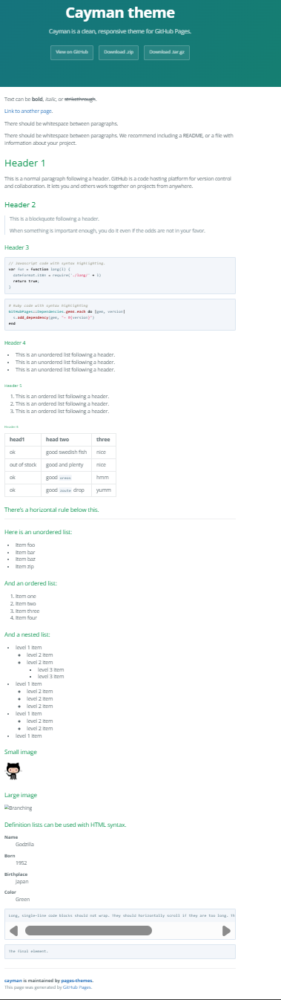|https://pages-themes.github.io/cayman/                |                           |
|Architect          |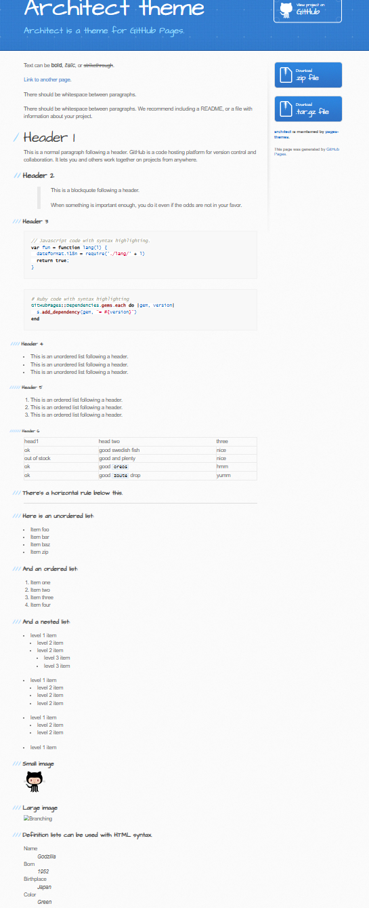|https://pages-themes.github.io/architect/             |                           |
|Dinky              |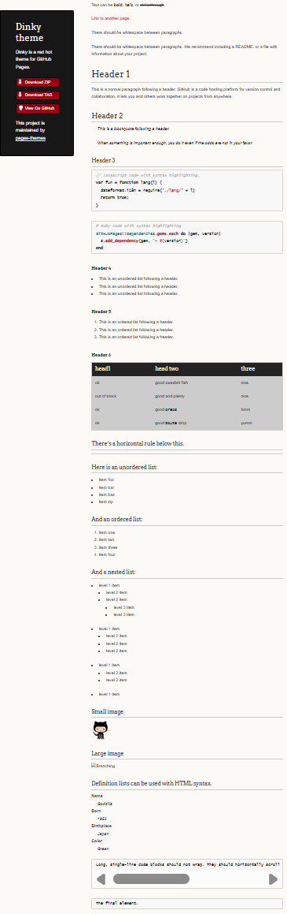|https://pages-themes.github.io/dinky/                 |                           |
|Hacker             |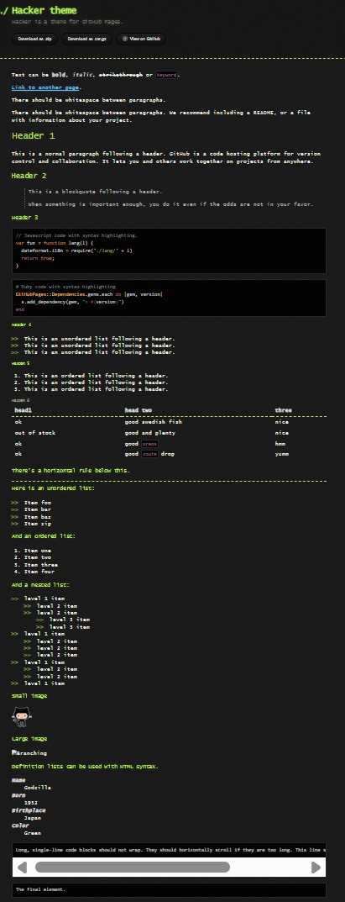|https://pages-themes.github.io/hacker/                |                           |
|Leap Day           |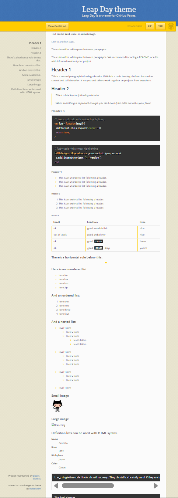|https://pages-themes.github.io/leap-day/              |                           |
|Merlot             |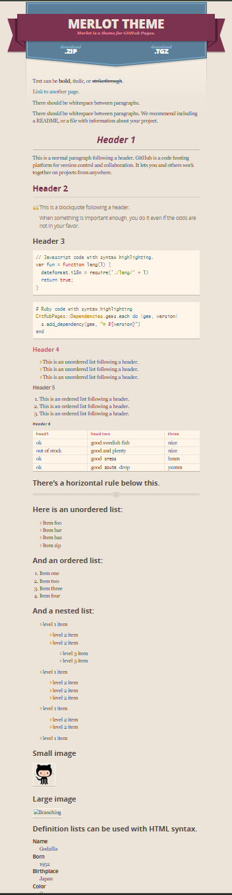|https://pages-themes.github.io/merlot/                |                           |
|Midnight           |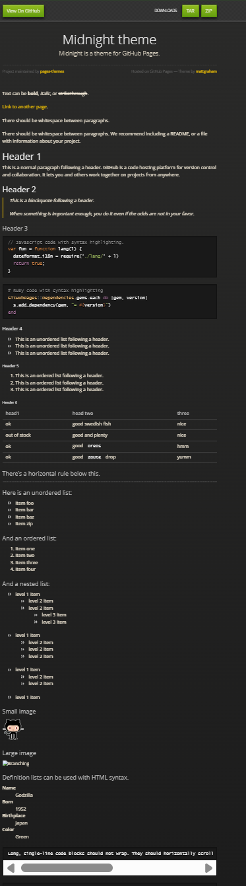|https://pages-themes.github.io/midnight/              |                           |
|Minimal            |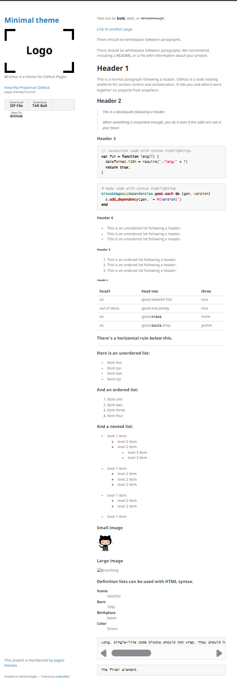|https://pages-themes.github.io/minimal/               |                           |
|Modernist          |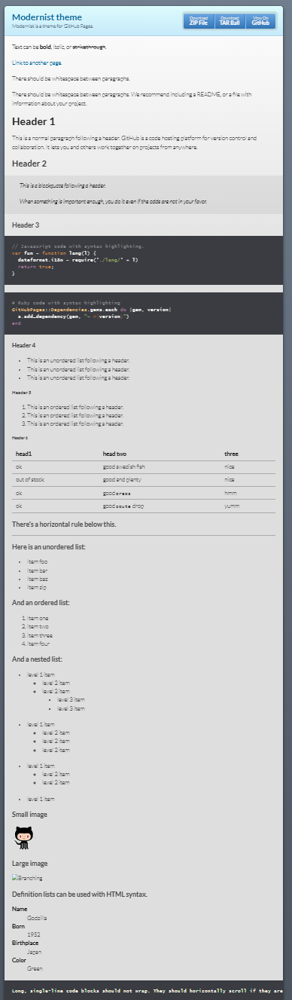|https://pages-themes.github.io/modernist/             |                           |
|Slate              ||https://pages-themes.github.io/slate/                 |                           |
|Tactile            |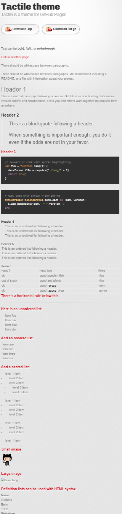|https://pages-themes.github.io/tactile/               |                           |
|Time Machine       |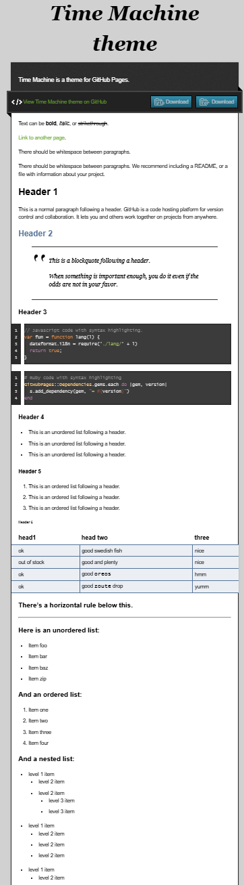|https://pages-themes.github.io/time-machine/          |                           |


Sources:
- https://medium.com/@ferreradaniel/how-to-create-unlimited-free-websites-with-github-pages-a-complete-guide-608cfd4fffcc
- https://share.google/CqmcZQNIugJzSSTIR
- Bit of google search
    